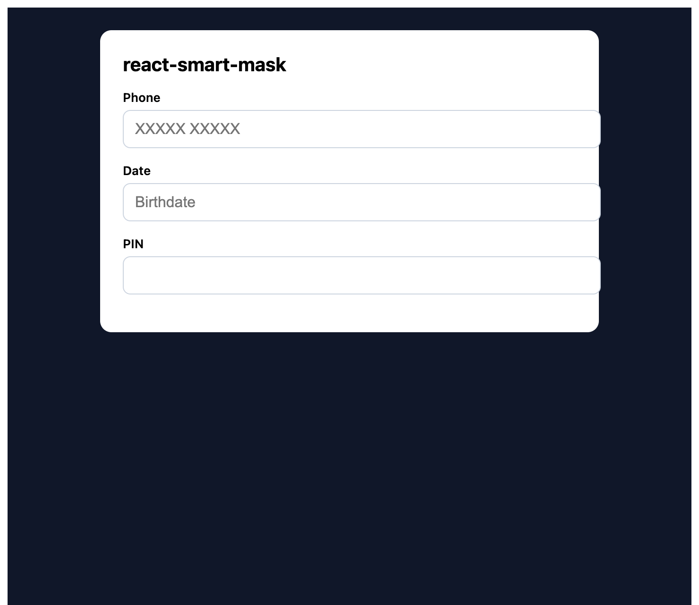

# react-smart-mask

Lightweight, TypeScript-first input masking for React 18 and React 19.



Phone, date, and PIN-style masks with formatted display, raw value, and completion state from `onChange` metadata.

## Features

- React 18 + 19 peer support
- Strict TypeScript types and generated `.d.ts`
- ESM + CJS builds with tree-shaking (`sideEffects: false`)
- Controlled and uncontrolled inputs with `ref` forwarding
- Caret-aware typing, Backspace/Delete, selection, paste, and cut
- Arrow/Home/End navigation that skips mask literals
- IME/composition-safe updates
- SSR/Next.js friendly (no `window` during render)
- Custom token patterns
- Accessibility-friendly (passes through ARIA/input props)

## Install

```bash
npm install react-smart-mask
```

## Basic usage

```tsx
import { MaskInput } from 'react-smart-mask';

<MaskInput mask="{+91 }99999 99999" placeholder="+91 XXXXX XXXXX" />;
```

Use `{...}` literal blocks or `\` escapes when mask literals contain token characters (`9`, `A`, `*`).

## Tokens

- `9` = digit
- `A` = letter
- `*` = letter or digit
- Other characters are literals; wrap ambiguous literals in `{...}` or escape with `\`.

## Controlled input

The `value` prop accepts raw user characters (unmasked):

```tsx
<MaskInput mask="99999 99999" value={rawPhone} onChange={(formatted, meta) => setRawPhone(meta.rawValue)} />
```

## Metadata

```tsx
<MaskInput
  mask="99999 99999"
  onChange={(value, meta) => {
    console.log(value);
    console.log(meta.rawValue);
    console.log(meta.isComplete);
  }}
/>
```

## Focus template (`maskChar`)

Show placeholders on focus (for example `__/__/____`):

```tsx
<MaskInput mask="99/99/9999" maskChar="_" placeholder="Birthdate" />
```

Prefix literals (for example `{+91 }`) appear on focus when the field is empty.

## Utilities

```ts
import { maskValue, unmask, applyMask, parseMask } from 'react-smart-mask';

maskValue('9876543210', '{+91 }99999 99999');
unmask('+91 98765 43210', '{+91 }99999 99999');
applyMask('9876543210', '{+91 }99999 99999');
```

## Custom tokens

```tsx
<MaskInput
  mask="AA-9999"
  maskOptions={{
    tokens: {
      A: /[A-Z]/,
    },
  }}
/>
```

## Development

```bash
npm install
npm run typecheck
npm test
npm run build
npm pack --dry-run
```

## License

MIT
